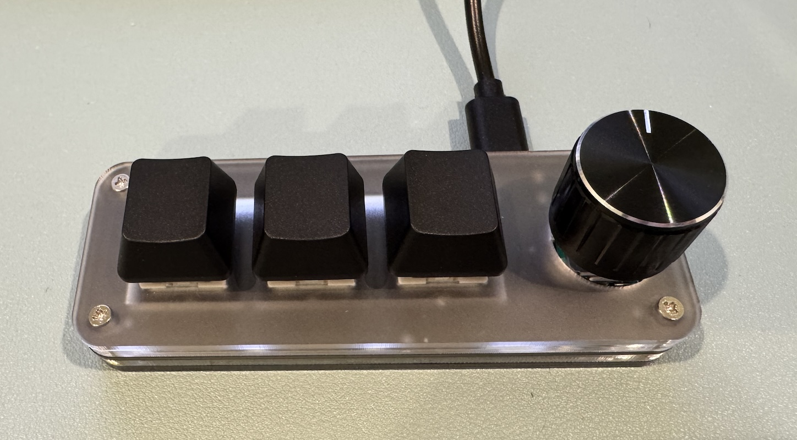
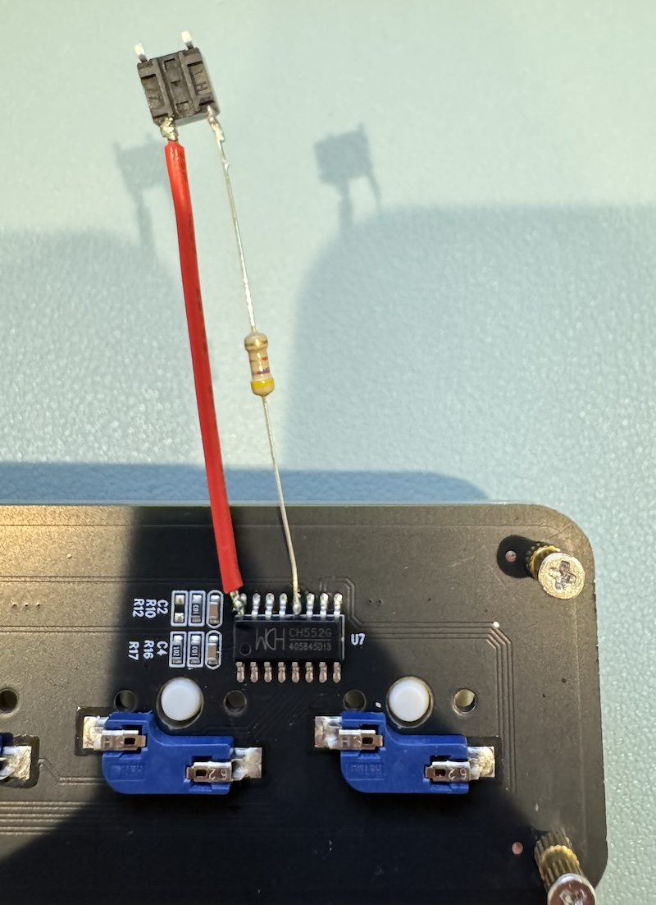

# CH552 Macropad v2

> [!NOTE]
> **A Note on LLM Usage:**
>
> This project was built with significant help from an LLM (`codex`).
>
> Any project of mine that uses help from an LLM will contain this message at the top of the README. If a project does not contain this message, it was fully written by me (a human)



_A three-key macropad of the type this project supports_

This project is an update to [CH552-macropad](https://github.com/perkinsb1024/CH552-macropad), a replacement firmware for generic wired USB macropads based on the [CH55xDuino library](https://github.com/DeqingSun/ch55xduino/).

This version adds a browser-based configurator, so you can change shortcuts, custom encoder actions, layers, and LED colors without editing or recompiling the firmware. Profiles are saved on the macropad; the configurator does not need to stay open during normal use.

**[Open the Macropad Configurator in GitHub Pages](https://perkinsb1024.github.io/CH552-Macropad-v2/)**

## Supported Macropads

The firmware supports three-key and six-key CH552 macropads with an encoder wheel. Select the correct variant before compiling. Four-key and wireless models are not supported by this build.

Look for a wired macropad like the one pictured above and check that it uses a CH552 chip. Similar-looking models can use different hardware. Some boards do not have RGB LEDs fitted.

You can configure:

- Keyboard shortcuts, text, mouse actions and media controls
- The encoder button and both rotation directions
- Up to four layers and two-key chords
- Key LED colors and layer indicators, including a rainbow effect

## How To Compile the Firmware

The current build and upload scripts target **macOS**. They use PlatformIO together with the compiler and upload tools installed by the CH55xDuino Arduino package.

Pre-built firmware files for both three-key and six-key macropads are available in [releases/](releases/). To use those, skip compilation and follow [How To Upload the Firmware](#how-to-upload-the-firmware)

### 1. Install the Tools

1. Install [PlatformIO IDE for VS Code](https://platformio.org/install/ide?install=vscode), or [PlatformIO Core](https://docs.platformio.org/en/latest/core/installation/index.html) if you prefer the command line
2. Install the [Arduino IDE](https://www.arduino.cc/en/software/)
3. In Arduino IDE's Settings/Preferences, add the following to **Additional Boards Manager URLs**:

   ```text
   https://raw.githubusercontent.com/DeqingSun/ch55xduino/ch55xduino/package_ch55xduino_mcs51_index.json
   ```

4. Open **Boards Manager**, search for **CH55xDuino**, and install version **0.0.25**. The build expects this version and its bundled tools. See the [CH55xDuino installation instructions](https://github.com/DeqingSun/ch55xduino/#installation) for more help.

Arduino IDE supplies the board package; compile and upload this project using PlatformIO.

On macOS, the package is normally installed at `~/Library/Arduino15/packages/CH55xDuino`. If yours is elsewhere, set its location before building:

```sh
export CH55XDUINO_PACKAGE_DIR="/path/to/packages/CH55xDuino"
```

### 2. Download the Project

Clone the repository, then open its folder in PlatformIO:

```sh
git clone https://github.com/perkinsb1024/CH552-Macropad-v2.git
cd CH552-Macropad-v2
```

Run the firmware commands below from this folder. In PlatformIO IDE, its terminal provides the `pio` command.

### 3. Select Your Macropad

In [platformio.ini](platformio.ini), set `board_build.physical_variant` to match your hardware:

| Macropad | Setting |
| --- | --- |
| Six keys and encoder | `board_build.physical_variant = 0` (default) |
| Three keys and encoder | `board_build.physical_variant = 1` |

The other board settings are already configured for this firmware.

### 4. Compile

```sh
pio run -t clean
pio run
```

A successful build creates `.pio/build/ch552/firmware.hex`. Clean and rebuild whenever you switch hardware variants or change firmware source files.

### Build Release HEX Files for Both Variants

The [releases](releases/) folder contains compiled firmware for three-key and six-key macropads. To refresh both files, run this from the project root:

```sh
pio run -t releases
```

This rebuilds both variants in separate build folders, without changing your selected variant in `platformio.ini` or uploading anything to hardware. It exports both files only after both builds succeed.

Filenames include the key count and the current commit's unique short Git hash, for example `ch552-macropad-3-key-a1b2c3d4.hex`. Git uses at least eight characters and extends the hash if needed to distinguish it from other objects in the local repository.

If firmware or build files have uncommitted changes, the name includes `dirty` before the hash, such as `ch552-macropad-6-key-dirty-a1b2c3d4.hex`. Commit those changes before generating files that should match a specific revision. README and image edits do not mark the firmware dirty.

After both builds and exports succeed, older generated HEX files are deleted so `releases/` keeps only the latest three-key and six-key pair. If a build fails, the previous release files are kept.

## How To Upload the Firmware

A macropad with its factory firmware usually needs **hardware bootloader entry for the first upload**. Once this firmware is installed, you can use the encoder button instead.

### First Upload: Enter the Bootloader Via Hardware

The following instructions and photo apply to the CH552G board shown in the original project. Confirm your chip's pin numbering and board layout before connecting anything.

1. Unplug the macropad from USB
2. Remove the bottom screws and acrylic plates to expose the CH552G chip
3. Locate **USB D+ (pin 12)** and **3.3 V (pin 16)**. On the pictured board, with the USB-C port toward the top, these are the fifth pin from the left and the leftmost pin on the top row, respectively.
4. Prepare a temporary connection between these pins. The photo below shows a button fitted for this purpose; the original project also describes using a jumper wire or metal tweezers.
5. Start the upload command:

   ```sh
   pio run -t upload
   ```

6. When the uploader says it is waiting for the bootloader, connect D+ to 3.3 V while the macropad is unplugged, plug it into USB, then release the connection. Do this within the uploader's **ten-second** waiting period.
7. Wait for the upload to finish. If it times out, unplug the macropad and repeat the upload and bootloader-entry steps.
8. Unplug the macropad before removing any temporary wiring or reassembling it, then reconnect it for configuration



_An example of using a temporary button to enter the bootloader before uploading firmware_

> [!CAUTION]
> **Warning:** Avoid bridging adjacent pins, especially ground (pin 14). Shorting a supply to ground can damage the board or USB port

### Later Uploads: Use the Encoder Button

After installing this firmware, start `pio run -t upload` and enter the bootloader when the uploader begins waiting:

- **At power-up:** Unplug the macropad, hold the encoder button, and reconnect USB. This method is always available, even if no valid profile is saved.
- **During use:** Hold the encoder button for three seconds. This requires the active layer's **Allow bootloader entry by long-pressing the encoder button** option to be enabled in a saved profile.

If the device cannot run the firmware, use the hardware method above to recover it.

## Configuring Your Macropad

### Use the Hosted Web App

No local web app installation is needed. Open the **[Macropad Configurator](https://perkinsb1024.github.io/CH552-Macropad-v2/)** in desktop Chrome, Edge, or another browser with WebHID support.

1. Plug the macropad into the computer running the browser. It must be running this firmware, rather than sitting in bootloader mode.
2. Click **Connect macropad** and select **Universal Macropad** in the browser's device chooser
3. Set up the keys, encoder, layers, chords and LED colors. If no valid profile is saved, the editor loads a starter profile for you to customize.
4. Click **Save to device** and wait for the saved confirmation. Changes in the editor take effect on the hardware only after saving.
5. Close the browser and use the macropad normally. Its saved profile survives unplugging it.

On first use, or when the saved profile is invalid, the keys and encoder stay inactive and one red LED blinks until you save a valid profile. This is expected; the USB configurator connection still works.

Use **Export JSON** and **Import JSON** in the Tools panel to back up and share profiles. Importing loads a profile into the editor; click **Save to device** to apply it to the macropad.

You can also edit offline or try a simulated macropad from the welcome screen. Browsers without WebHID, including Safari and Firefox, can edit and export profiles but cannot save them directly to hardware.

### Run the Web App Locally

For development or local use, install [Node.js](https://nodejs.org/) (Node 22 recommended), then run:

```sh
cd webapp
npm ci
npm run dev
```

Open the localhost URL printed in the terminal, normally **http://localhost:5173**. Keep the terminal running while using the app; press **Ctrl+C** to stop it.

To open the editor on another device on the same Wi-Fi, start it with:

```sh
npm run dev -- --host 0.0.0.0
```

Open the printed network URL on the other device. Plain HTTP over the network supports editing and exporting profiles, but hardware access requires HTTPS or localhost. The hosted GitHub Pages app provides HTTPS without local certificate setup. In all cases, USB access is to the macropad plugged into the computer running the browser.

To build the static site locally:

```sh
npm run build
npm run preview
```

The production files are written to `webapp/dist/`. This repository's [GitHub Actions workflow](.github/workflows/deploy-pages.yml) tests, builds and publishes the configurator when changes under `webapp/` are pushed to `main`.

## Troubleshooting

- **Missing CH55xDuino component:** Install board package version 0.0.25 and check `CH55XDUINO_PACKAGE_DIR` if you use a custom location
- **Upload cannot find the device:** Use a USB data cable, wait for the upload prompt, and enter the bootloader within ten seconds. Factory firmware generally needs the hardware method.
- **Macropad does not appear in the browser:** Use a supported desktop browser, HTTPS or localhost, and this firmware. Reconnect USB after uploading.
- **One red LED blinks and inputs do nothing:** Connect the configurator and save a valid profile
- **The wrong keys respond:** Check the physical variant in `platformio.ini`, clean the build, and upload again

For Linux WebHID permissions, see the [web app README](webapp/README.md#linux-device-access). The firmware build and upload scripts currently target macOS.

## Further Documentation

- [Web app development and usage](webapp/README.md)
- [Configuration format](protocol/config-v2.md)
- [USB configuration protocol](protocol/hid-v1.md)
