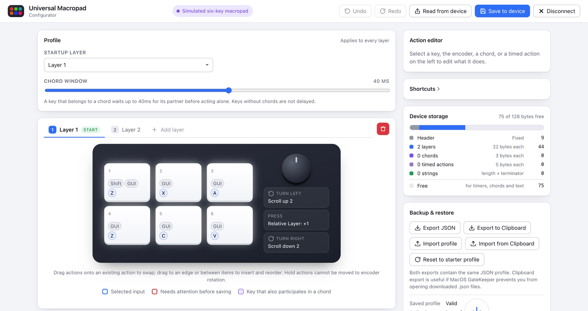
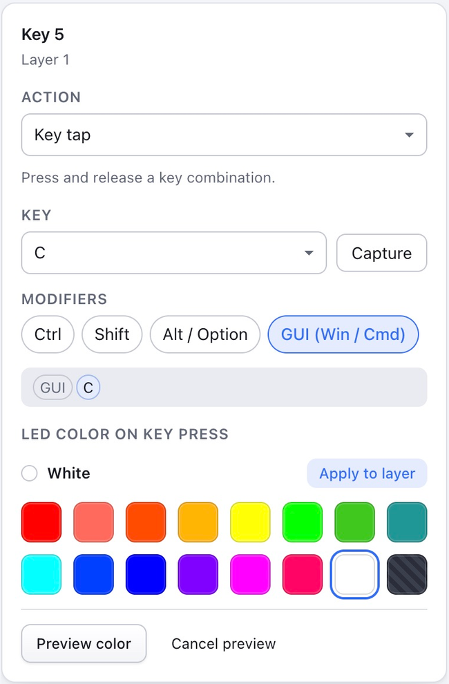
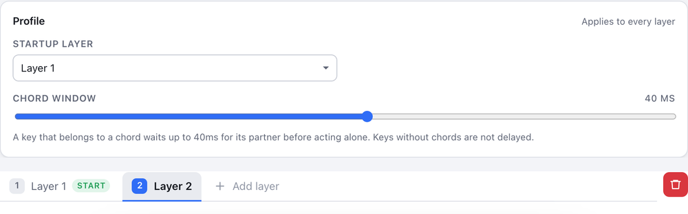
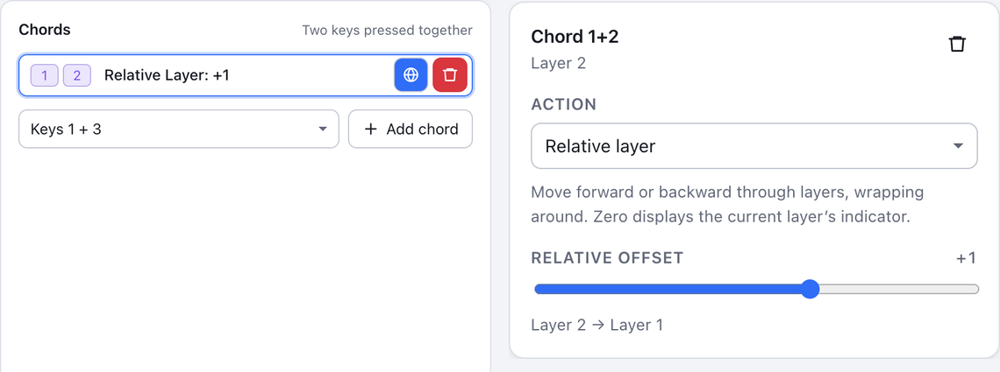
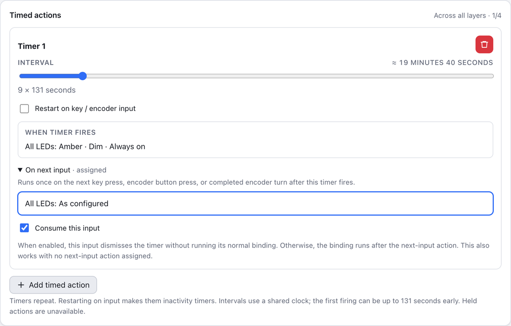
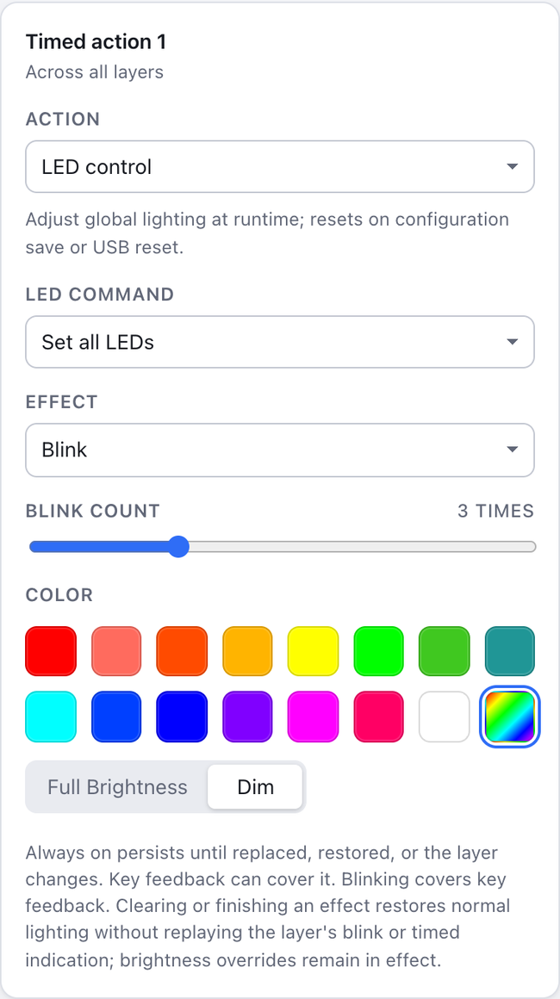
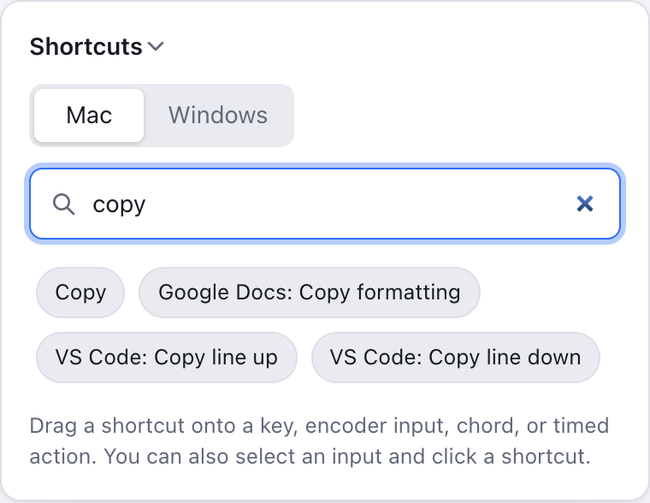
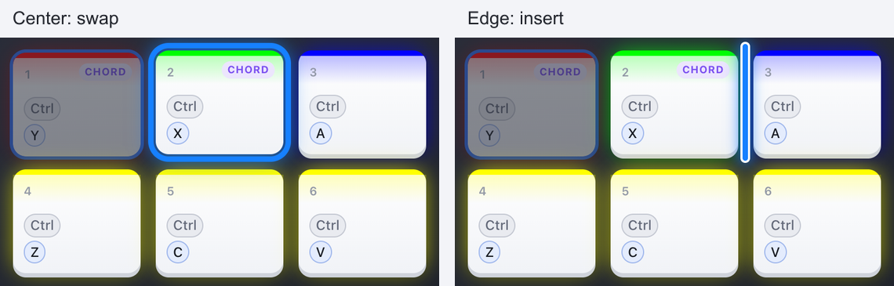
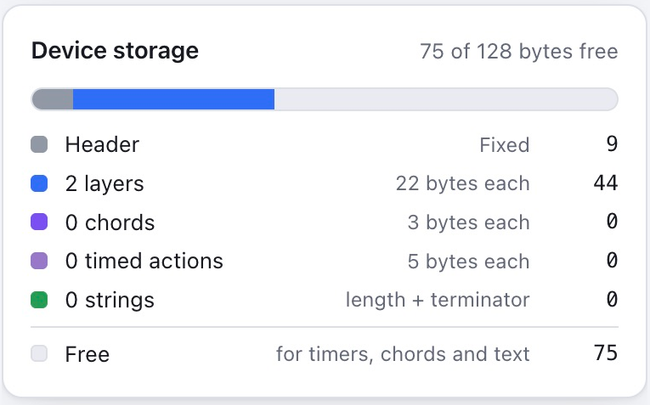
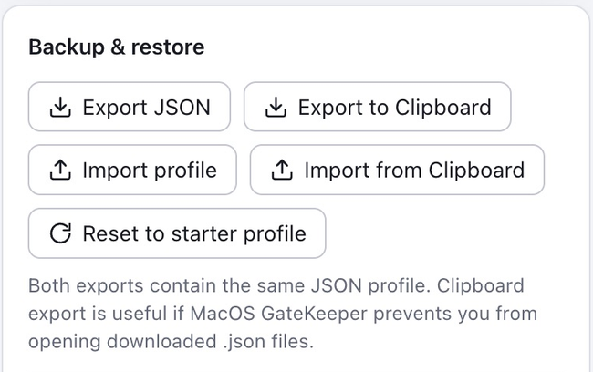

# Configuration Overview

Using this macropad gives you quick access to the things you do most often: copy and paste, control music, scroll, type short phrases, take screenshots, or use the built-in LEDs as a reminder to take a break and stretch.

You configure it in your browser with the configurator tool. Once you click **Save to device**, the settings stay on the macropad — even when you unplug it or use it on a different computer. You do not need to keep the configurator open for the macropad to work.

This guide covers the current configurator and its supported three-key and six-key wired macropads with a clickable wheel. Your device needs this project's firmware installed first; factory settings cannot be edited with this tool. See the [setup instructions](../README.md#how-to-upload-the-firmware) if it has not been installed yet. Some macropads do not have LEDs fitted.

## Index

1. [Get Connected—or Try a Virtual Macropad](#get-connectedor-try-a-virtual-macropad)
2. [Find Your Way Around](#find-your-way-around)
3. [Configure Your First Shortcut](#configure-your-first-shortcut)
4. [Triggers: What Starts an Action](#triggers-what-starts-an-action)
5. [Available Actions](#available-actions)
6. [Layers: Several Sets of Controls](#layers-several-sets-of-controls)
7. [**Chords**: Two Keys Together](#chords-two-keys-together)
8. [Timed Actions and Reminders](#timed-actions-and-reminders)
9. [LED Colors and Effects](#led-colors-and-effects)
10. [**Shortcuts**, **Copy** and **Paste**, and Drag and Drop](#shortcuts-copy-and-paste-and-drag-and-drop)
11. [**Macros**](#macros)
12. [The 128-Byte Configuration Size Limit](#the-128-byte-configuration-size-limit)
13. [Save, Back Up, and Restore](#save-back-up-and-restore)
14. [Example Configurations](#example-configurations)
15. [Troubleshooting](#troubleshooting)
16. [Advanced: Gotchas and Things to Watch Out for with Timed Actions](#timed-action-gotchas)

## Get Connected—or Try a Virtual Macropad

### Connect Your Own Device

1. Open the [Macropad Configurator](https://perkinsb1024.github.io/CH552-Macropad-v2/) in desktop Chrome or Edge
2. Plug in your macropad with a USB data cable
3. Click **Connect macropad**. Choose **Universal Macropad** in the browser's device chooser and connect
4. The configurator loads the saved profile from your device. If the macropad has no valid profile, the configurator defaults to a starter profile instead
5. Make your changes, click **Save to device**, and wait for **Saved** before unplugging it

If the macropad blinks one red LED, that indicates there is no saved profile (or an invalid saved profile). Simply save a new profile to activate it.

### Practice without Hardware

Open a [virtual three-key macropad](https://perkinsb1024.github.io/CH552-Macropad-v2/?sim=three) or a [virtual six-key macropad](https://perkinsb1024.github.io/CH552-Macropad-v2/?sim=six). You can also open **More connection options**, the arrow beside **Connect macropad**, and choose a simulated device.

The simulator lets you explore the editor and practice saving a profile. Saving there only updates the virtual device; it does not configure your physical macropad or send real keyboard and mouse actions to your computer. Export a profile you want to keep.

For editing without a connection, choose **edit offline** for a three-key or six-key device on the welcome screen. Safari and Firefox can edit and export profiles, but cannot save them directly to a USB macropad. To apply an offline profile, connect the matching physical device in a supported browser, import your exported profile, and save it.

## Find Your Way Around

*Screenshots in this guide use a simulated device. The controls work the same way when editing a connected macropad.*

| Area | What it does |
| --- | --- |
| Top bar | Connect, undo or redo edits, read saved settings, and save to the device |
| **Profile** | Choose the startup layer and chord timing. **Rainbow** settings and the meaning of an “**Off**” key LED appear when relevant. These settings apply across layers |
| Layer tabs | Choose which layer you are editing, add a layer, or rearrange layers |
| Macropad layout | Click a numbered key, **Turn left**, **Press**, or **Turn right** to select its action |
| **Action editor** | Choose what the selected control does and adjust its settings. For a numbered key, you can also pick its key-press color here |
| **Chords** | Assign actions to two-key combinations |
| **Layer options** | Set the current layer's indicator lighting |
| **Timed actions** | Run actions repeatedly or after inactivity, across all layers or on one selected layer |
| **Shortcuts** | Search ready-made actions and drag them onto an input |
| **Device storage** | See how much of the 128-byte budget your profile uses |
| **Backup & restore** | Export, import, or reset the profile in the editor |

Clicking a layer tab changes the editor's view, it does not update the physical macropad, which changes layers using a configured action. The **Active layer** readout in **Backup & restore** shows the layer the connected device is currently using.

## Configure Your First Shortcut

For example, make a key copy the selected text:

1. Select the layer you want to edit, then click a numbered key in the macropad picture
2. In **Action**, choose **Key tap**
3. Choose **C** in the **Key** list
4. Enable **Ctrl** for Windows, or **GUI (Win / Cmd)** for Mac. Leave the other modifiers off
5. Pick an **LED color on key press**, if desired
6. Click **Save to device** and wait for **Saved** to appear
7. Select some text in another application and press your macropad key

Instead of selecting the individual keyboard keys your macropad should send, you can also click **Capture**, then press the desired combination on your normal keyboard. The configurator fills in the key and modifiers automatically. If your operating system or browser intercepts that combination, select it manually instead.

For a quicker option, expand the **Shortcuts** section, choose **Mac** or **Windows**, search for “copy,” and drag **Copy** onto a numbered key in the macropad picture. The correct keys will automatically be assigned to that key.

## Triggers: What Starts an Action

An action is what the macropad does. A trigger is what makes it happen.

| Trigger | How it works |
| --- | --- |
| Numbered key (1 - 3 or 1 - 6)| Press it to run its assigned action. A hold action stays active until you release the key |
| Wheel button: **Press** | Push down on the wheel. It supports ordinary actions and hold actions, just like a key |
| Wheel: **Turn left / Turn right** | Each completed wheel click, also called a detent, runs that direction's action. Configure the two directions separately |
| Two-key chord | Press two numbered keys together within the chord window. The chord action replaces their individual actions (a small delay is required for individual keys that are part of a chord) |
| Timer | Runs its action whenever its interval expires. The timer can optionally restart when you interact with the macropad |
| **On next input** after a timer | Runs once when you next press a key or use the wheel, after that timer has fired |

There are no separate user-configurable double-tap or long-press triggers for ordinary actions. **Key hold** means “keep this action held while I hold the button,” rather than “wait before starting.” The only exception is the optional three-second wheel button hold to enter firmware update mode (this is an advanced setting mostly used for development, I recommend leaving it off).

Actions that need a button release—**Key hold**, **Mouse hold**, **Layer while held**, and pointer movement set to **Hold**—cannot be used for wheel rotation or timer actions as those triggers have no button to release.

## Available Actions

### Keyboard

| Action | What it does | Example |
| --- | --- | --- |
| **Key tap** | Presses and releases one key, optionally with modifiers. Holding the macropad key does not turn this into a hold action | **Ctrl+C**, **Command+V**, **Enter**, or F5 |
| **Key hold** | Keeps the chosen key and modifiers held until you release the macropad button. The application may repeat a held key as it would on a normal keyboard | Hold **Shift**, an arrow key, or a game movement key |

Choose one main key plus any combination of **Ctrl**, **Shift**, **Alt / Option**, and **GUI (Win / Cmd)**. “**GUI**” means the Windows key on Windows and Command on Mac. Choose **No key (modifiers only)** to use a modifier by itself.

The key list includes letters, numbers, punctuation, function keys, navigation keys, editing keys, numpad keys, and other standard keyboard keys. A shortcut's result depends on the application and operating system receiving it. The macropad sends the key or key combination exactly how an ordinary keyboard would.

### Mouse

| Action | What it does |
| --- | --- |
| **Mouse click** | Clicks your selected mouse button or buttons 1–16 times: choose **Single**, **Double**, or **Custom** |
| **Mouse hold** | Keeps the selected mouse buttons down while you hold the macropad button; useful for dragging |
| **Mouse toggle** | Press once to keep the selected mouse buttons down; activate the same input again to release them. Changing layers also clears toggled mouse buttons |
| **Scroll** | Sends a scroll step. Choose **Vertical** with **Up**/**Down**, or **Horizontal** with **Left**/**Right**, and a **Wheel step** from 1–127 (horizontal requires v9 firmware) |
| **Move pointer X** | Moves left or right by the selected amount, from 1–127 |
| **Move pointer Y** | Moves up or down by the selected amount, from 1–127 |

Mouse button actions offer **Left**, **Middle**, and **Right**. You can select more than one (though that's not typically useful... How often do you press more than one mouse button at once?)

**Custom** shows a 3–16 click-count slider. Its last count is remembered per action
slot when you switch to **Single** or **Double** and back. The duration hint is rounded
to one decimal: about 0.4 seconds for three clicks and 3.1 seconds for sixteen.
Each press lasts at least 8ms, with a 200ms pause between clicks; USB delays can
extend the sequence. Subsequent queued actions wait for it to finish, while holds,
media controls and layer/LED actions use independent handling. Your computer
decides whether the sequence is recognized as a double-click or another gesture.

Some computers invert scroll directions. If the selected direction behaves
backwards, swap **Up**/**Down** or **Left**/**Right**. Under **Scroll direction**,
**Click here** opens **Scroll & click test** with a scrollable area on both axes
and click counters for each mouse button. Save edits to the macropad before
testing; the modal warns if you have unsaved changes.

For scrolling or pointer movement on a button or chord, choose **Tap** for one step
or **Hold** for repeated movement until release. Start with a small amount. Held
scrolling waits at least 100ms after the complete previous step and repeats when
playback and USB output are idle (about ten steps per second at step 1); release stops
new repeats, while an accepted step finishes. Wheel rotation and timers send one
step each time they run. Pointer speed and scroll distance can vary with your
computer's settings and the application.

### Media and System

Choose **Media / system**, then a named **Control**:

| Group | Available named controls |
| --- | --- |
| Volume | **Volume up**, **Volume down**, **Mute** |
| Playback | **Play / pause**, **Play**, **Pause**, **Stop**, **Next track**, **Previous track**, **Fast forward**, **Rewind**, **Eject** |
| Display and system | **Brightness up**, **Brightness down**, **Power**, **Sleep** |
| Launch | **Calculator**, **File browser**, **Email**, **Media player** |
| Browser | **Web search**, **Browser home**, **Browser back**, **Browser forward**, **Browser stop**, **Browser refresh**, **Bookmarks** |

Your computer, application, or display must support the selected control. For example, a brightness action may have no effect on an external monitor (though if you're on MacOS, I recommend checking out [Lunar](https://lunar.fyi/), which allows these keys to control many external monitors). The **Custom usage...** entry is an advanced option; use the named choices for ordinary configuration.

**Media / system** sends a tap. Choose **Media / system hold** to keep the control
held until release; the selected **Control** is preserved when switching between
these actions. The host decides whether a sustained control repeats. Holds are
available on keys, chords and the wheel button, but not wheel turns or timers.
The newest media action wins, including a tap interrupting a hold. Releasing it
does not restore a previous still-held control. Keyboard and media holds retain
their original binding across layer changes until physical release. Releasing
either key of a chord ends its hold.

### Type Text

**Type text** types a short saved phrase into the application that currently has focus. It works like typing on a keyboard, rather than pasting from your computer's clipboard.

Supported text includes ordinary English letters, numbers, spaces, standard punctuation, tabs, and line breaks. Accented letters, emoji, smart quotes, and other special characters are not supported. Replace curly quotes with straight quotes if needed.

Text is typed using the US keyboard layout. A different keyboard layout on your computer may produce different characters. Line breaks act like **Enter** and tabs act like Tab, so be careful when using them. They may submit a form or move to another field depending on where you type.

**Type text** waits 32ms after each character's key release before continuing, including after tabs, newlines and the final character. Inputs and USB continue to be serviced during the wait. Applications may still need an explicit **Pause** before Enter in a macro.

The **Text** field shows its storage cost. **Reuse an existing string…** lets you select text already used elsewhere in your profile. Identical text does not use additional storage, even when several controls use it. See [the storage limit](#the-128-byte-configuration-size-limit) before adding long phrases.

> [!WARNING]
> While it is technically possible to use the **Type text** feature to save and enter your password, you should *never* do this. This device does not feature any encryption or protection. Anyone with access to this device would have access to your password. This is the job of a password manager.

### Leaving an Input Empty

Choose **Nothing** to leave an input unassigned. A numbered key can still have a key-press color when its action is **Nothing**. Unassigned inputs do not inherit an action from another layer.

## Layers: Several Sets of Controls

Think of a layer as another page of buttons on the same macropad. **Layer 1** might contain editing shortcuts, while **Layer 2** controls music. The same key can copy on one layer and mute on another. The most common example of keyboard layers is the **Shift** or Caps Lock key. Think of the lowercase letters and numbers as one layer, while pressing shift or caps lock activates a second layer containing the uppercase letters and punctuation. **Shift** is a momentary layer change, while caps lock is persistent. Both types of layer changes ([and more!](#choose-how-to-switch-layers)) are supported by this macropad.

A layer contains all numbered-key actions and key-press colors, the wheel button and both turn actions, and its layer options. **Chords** can belong to a layer or apply globally to all layers. Timers are always global.

You can have up to seven layers on a three-key macropad, or five on a six-key macropad, unless you are using optional features like chords and text strings, which will reduce the available space for layers.

### Add, Edit, and Remove Layers

- Click a layer tab to edit it
- **Add layer** copies the currently selected layer, including its key colors, wheel settings, options, and local chords to a new layer. Change the copy to make it your new set of control (hint: you can quickly remove unwanted actions by selecting a trigger and pressing **delete**). **Global** chords and timers assigned to **All layers** are already shared. Layer-specific timers keep their original assignment
- Choose the **Startup layer** in **Profile**. This is the layer used when the device starts and after a configuration save
- The trash button beside the layer tabs removes the selected layer, its bindings, and its local chords after confirmation. **Global** chords are preserved. At least one layer must remain. If you remove the startup layer, **Layer 1** becomes the startup layer
- After removing a layer, review all layer-switch actions. A target may become unavailable or now refer to another layer at that number

### Choose How to Switch Layers

| Action | Behavior |
| --- | --- |
| **Switch to layer** | Changes to your chosen layer and stays there until another layer action changes it (like the caps lock key in the earlier example) |
| **Switch to layer (one-shot)** | Visits your chosen layer for the next action, then returns. You do not need to keep the switching button held |
| **Layer while held** | Uses the chosen layer while the switching button or chord is held, then returns when released (like the shift key in the earlier example) |
| **Relative layer** | Moves forward or backward by your chosen number of layers. +1 means next; −1 means previous in numerical order. It wraps around at either end |
| **Relative layer (one-shot)** | Visits a layer at the chosen offset for the next action, then returns |

For **Switch to layer** and its one-shot version, the target list also includes **Previous layer**. This means the previously selected layer on the device, rather than simply the next lower layer number. Repeating a **Previous layer** action swaps between those two layers. Temporary one-shot and held visits do not affect the previous layer history.

An offset of 0 stays on the current layer and will replay its layer indicator. This is useful with **Blink by layer number** when you want a “which layer am I on?” button. With no indicator, or an always-on indicator, it has no effect.

*Give yourself a route back.* Add a layer-switch button on every layer, or make a global chord that cycles layers. Clicking layer tabs in the configurator does not change the selected layer on your macropad. Review any **Layer reachability** warnings before saving.

The reachability check tracks persistent layer history and pending one-shot returns. It warns when a reachable layer cannot return to startup, including when only some histories leave you trapped. **Previous layer** is one remembered layer, not a stack: with **Layer 1** → **Layer 2** → **Layer 5**, Previous on **Layer 5** returns to **Layer 2**; another Previous returns to **Layer 5**, not **Layer 1**. A direct jump from **Layer 1** to **Layer 5** can still return to **Layer 1**, so the warning for **Layer 5** depends on history. A simple two-layer Previous toggle with a reliable route back does not need a warning.

This is a route check, not a complete simulation of physical inputs: timer actions are treated as possible transitions without enforcing their timing, order or input consumption, and multiple held-layer inputs are approximated. Having no reachability warnings does not guarantee that every input sequence is safe.

## Chords: Two Keys Together

A chord assigns an extra action to a pair of numbered keys. For example, Key 1 can copy, Key 2 can paste, and **Keys 1 + 2** together can switch layers.

1. Select the layer where you want the chord
2. In **Chords**, choose a **Key pair** and click **Add chord**
3. Click the chord row and choose its action in the **Action editor**
4. Leave it local to that layer, or click its **globe** button to make it global
5. Save the profile, then press the two keys together to try it. Make sure you press the two keys nearly simutaneously. By default the **Chord window** (the time duration you get to press both keys) is just 40 milliseconds

**Local** chords apply only on their layer. **Global** chords appear across layers and use the same action everywhere. A local chord for the same key pair takes priority on its layer. Only one global chord can use a given pair. The editor prevents conflicting choices.

**Chords** use exactly two numbered keys. The wheel button and wheel turns are not chord members. A three-key pad has three possible pairs; a six-key pad has fifteen, although storage limits how many you can assign.

### Chord Timing

The **Chord window** in **Profile** is how long the first key waits for its partner. It ranges from 5–75 milliseconds, in steps of 5; the starter setting is 40ms, or four one-hundredths of a second.

- A larger window makes chords easier to press but adds a small delay to individual keys that belong to a chord
- A smaller window makes those individual keys respond sooner, but requires more nearly simultaneous presses
- Keys that do not belong to a chord on the selected layer have no delay
- **Off** disables chord recognition without deleting your saved chords. Keys then act immediately

A recognized chord runs its action instead of the two individual actions. For a hold action, releasing either chord key ends the hold. Release both keys before attempting the same chord again. If you miss the timing window, the keys act individually.

## Timed Actions and Reminders

You can add up to four timed actions, depending on remaining configuration storage space. They repeat automatically and can operate across all layers or on one selected layer.

1. Click **Add timed action**
2. Choose **All layers** or a specific layer in **Run on**, then set **Interval** with the slider
3. Set **Reset timer on input** to **Yes** or **No**
4. Click **When timer fires**, then choose its action in the **Action editor**
5. Optionally expand **On next input** and configure a follow-up action and **Consume this input**
6. Save to the device

### Repeating versus Inactivity Timers

| Setting | Result |
| --- | --- |
| **Reset timer on input** set to **No** | Repeats at the selected interval, even while you use the macropad |
| **Reset timer on input** set to **Yes** | Resets the timer whenever you press a macropad key, press the wheel button, or turn the wheel. Useful for actions based on inactivity |

“Input” means activity on the macropad. Using your computer's regular keyboard or mouse does not restart these timers. Keeping a button held only resets the timer when you first press the button.

The interval uses steps of 4.096 seconds, up to 2 hours 19 minutes 48.608 seconds.
Use the slider to select the interval; its label shows the approximate duration
in hours, minutes and seconds as needed. Each timer measures from its own last start or restart,
with less than 16ms of early clock quantization. A one-step interval becomes
due about 4.080–4.096 seconds after its reset. Polling, queued output and the
device clock can add timing error. Each timer uses six bytes of device storage.

A timer assigned to a layer advances only while that layer is active. Every
actual layer change resets layer-specific intervals, so returning to the layer
starts a fresh interval. Global timers continue through layer changes. Already
armed **On next input** actions remain armed and run on the next macropad input,
even if their timer's assigned layer is no longer active.

### On Next Input

After a timer has fired, its optional **On next input** action runs once when you next use a macropad input. It can restore the lighting after a reminder, for example.

- With **Consume this input** off, the follow-up action runs and then the input's normal action runs too
- With **Consume this input** on, the input dismisses the reminder without running its normal action. Press or turn again to use the normal action
- Consumption works even if the follow-up action is **Nothing**

This follow-up does not stop the repeating timer. Multiple timers can be waiting for the same next input, so plan their actions together. Both timer action slots support actions that do not need a release, including text, media controls, layer changes, mouse steps, and LED controls.

For a complete lighting reminder, see [the example configuration](#create-a-reminder-to-take-a-break).

For interactions between multiple timers and layer changes, see [Gotchas and Things to Watch Out for with Timed Actions](#timed-action-gotchas) at the end of this guide. Expand the section to read it.

## LED Colors and Effects

There are three main ways to use lighting: a color when a key is pressed, a layer indicator, and an **LED control** action that changes lighting during use.

The fixed color palette offers **Red**, **Coral**, **Orange**, **Amber**, **Yellow**, **Green**, **Leaf**, **Teal**, **Cyan**, **Azure**, **Blue**, **Violet**, **Magenta**, **Rose**, and **White**. The final swatch is **Off** for key-press colors, or **Rainbow** for layer indicators and temporary effects. Custom colors are not available.

### Key-Press Colors

Select a numbered key, then choose **LED color on key press** in the **Action editor**. **Apply to layer** copies that color to every numbered key on the current layer; it leaves their actions unchanged. key-press colors always use full brightness (unless altered by an [**LED Control** command](#led-control-actions-during-use)).

**Preview color** temporarily shows the selected color on the connected device without saving your profile. **Cancel preview** returns to its usual lighting. A preview is not a saved setting. If preview is unavailable on your device, use its saved settings to test the result.

### Layer Indicators

In **Layer options**, set **Layer selection LEDs**:

| Mode | What you see |
| --- | --- |
| **Do not indicate** | No layer indication; key-press colors can still work |
| **On for 1.5 seconds** | Shows the chosen layer color or rainbow briefly when selecting the layer |
| **Blink by layer number** | Blinks once for **Layer 1**, twice for **Layer 2**, and so on. Each blink is a quarter-second on and a quarter-second off |
| **Always on** | Idle keys show the layer color or rainbow; pressed keys show their individual key-press colors |

Choose the **Layer indicator color** and **Full Brightness** or **Dim**. The timed and blinking indications temporarily cover key-press colors. The always-on background allows key-press colors to show over it.

### Rainbow Settings and an Off Key

When a layer uses a rainbow indicator, **Profile** shows settings to adjust the rainbow (applies to all layers):

| **Rainbow phase spacing** | Appearance |
| --- | --- |
| **0° — All LEDs together** | All LEDs cycle through the same color at the same time |
| **30° — Gentle color wave** | Neighboring LEDs have similar colors |
| **60° — Rainbow sweep** | A wider spread of colors across the keys |
| **Variable — Scattered colors** | A more scattered spread of colors |

**Rainbow speed** offers **Extra fast**, **Fast**, **Slow**, and **Extra slow**. These settings apply across layers. Save changes before expecting device color previews to use the new speed or spacing. An [**LED control** action](#led-control-actions-during-use) can also change them during use.

If you combine an **Always on** layer indicator with an **Off** key-press color, **Profile** offers **For key LEDs, “Off” means**:

- **Transparent:** pressing an **Off**-colored key leaves the idle background visible
- **Black:** pressing it makes that key go dark over the always-on background

This setting applies across layers. Timed and blinking layer indications still cover the key colors while their indication runs.

### LED Control Actions during Use

Choose **LED control** as an input's action, then select an **LED command**. These actions let you adjust lighting without reopening the configurator. The adjustments apply across layers and reset when you save a configuration or reset/reconnect the device.

| Command | What it changes |
| --- | --- |
| **Set rainbow phase spacing** | Selects a specific spacing, or restores **As configured** |
| **Relative rainbow phase spacing** | Steps through the spacing choices, wrapping around |
| **Set rainbow speed** | Selects a speed, or restores **As configured** |
| **Relative rainbow speed** | Steps through speeds. Positive steps move toward faster choices; negative steps toward slower ones, wrapping around. Follow the cycle shown in the editor |
| **Set layer-indicator brightness** | Forces the indicator off, dim, or bright, or restores its configured brightness |
| **Relative layer-indicator brightness** | Cycles through off, dim, and bright |
| **Set key-press brightness** | Forces key feedback off, dim, or bright, or restores configured behavior |
| **Relative key-press brightness** | Cycles key feedback through off, dim, and bright |
| **Set both brightnesses** | Applies the same brightness choice to both kinds of lighting |
| **Relative both brightnesses** | Starts from the brighter current brightness, applies the relative step, and sets both to the same result |
| **Set common brightness preset** | Applies one of the combinations listed below |
| **Relative common brightness preset** | Cycles through those preset combinations |
| **Toggle preset on/off** | Applies the chosen preset; when that preset is active, activating again restores configured layer and key brightness. This affects brightness only, rainbow speed and spacing stay unchanged |
| **Set all LEDs** | Starts or clears a temporary color or rainbow effect; see below |
| **Restore all configured LED settings** | Restores configured lighting, including brightness, rainbow settings, and temporary effects |

The common brightness presets are:

1. **Both as configured**
2. **Layers dim, keys bright**
3. **Layers and keys dim**
4. **Layers off, keys dim**
5. **Both off**

Relative settings use a **Relative step** to choose direction and, for rainbow controls, whether to skip a choice. The editor shows the cycle order. **Relative both brightnesses** resolves each current brightness, starts from the brighter one, and applies the step once through **Off** → **Dim** → **Bright** → **Off** (backwards for a negative step). It sets both brightnesses to that same result.

For example, **Dim** indicator + **Bright** key feedback becomes both **Off** with +1, or both **Dim** with −1. **As configured** resolves to the current layer's saved indicator brightness and **Bright** key feedback before comparing. This uses the brightness settings, regardless of whether an indicator or key is currently lit.

Earlier firmware advanced both brightnesses independently; update the firmware to get synchronized stepping. Existing profiles need no conversion.

Indicator brightness preserves the selected indicator mode: making it bright does not turn **Do not indicate** into an always-on background (use **Set all LEDs** to accomplish that). Forcing key feedback off lets the idle background show through.

### Temporary Effects: Set All LEDs

With **LED command → Set all LEDs**, choose:

| Effect | Behavior |
| --- | --- |
| **As configured** | Clears the temporary effect and returns to normal lighting |
| **Always on** | Shows the chosen color or rainbow until another effect replaces it, you restore lighting, or the layer changes. Key feedback can appear over it |
| **Blink** | Blinks the chosen color or rainbow 1–8 times, then returns to normal lighting. It covers key feedback during the effect |

Choose a color or **Rainbow**, plus **Full Brightness** or **Dim**, for **Always on** and **Blink** effects. These do not replace the layer's saved color settings.

Finishing or clearing an effect returns to normal lighting without replaying the layer's timed or blinking selection indication. Existing brightness overrides remain active when you clear an effect with **As configured**. Use **Restore all configured LED settings** to clear those overrides too.

## Shortcuts, Copy and Paste, and Drag and Drop

### Use the Shortcut Library

Expand **Shortcuts**, select **Mac** or **Windows**, and search for an action name or application. The library includes everyday editing, browser controls, window management, screenshots, media keys, standard keyboard keys, and application-specific shortcuts for Word, Google Docs, PowerPoint, VS Code, Vim, and tmux, plus short text snippets.

Drag a shortcut onto a numbered key, wheel input, chord, or timer action to replace that input's action. Clicking a shortcut does not apply it. Dragging from the library copies the preset; it does not remove it from the library or change the key's key-press color.

Check the **Action editor** afterward to see the assigned combination or text. Application shortcuts depend on the application, its mode, and your computer's settings. Text snippets insert literal text; they do not automatically wrap a selection or move the cursor into a template.

### Copy or Move an Existing Action

1. Click the input you want to copy in the macropad layout, chord list, or timer section
2. Press the usual copy shortcut (shown below)
3. Select the destination input, changing layer tabs first if needed
4. Press paste. The destination's previous action is replaced

| Edit | Windows | Mac |
| --- | --- | --- |
| **Copy** selected input | **Ctrl+C** | **Command+C** |
| **Cut** selected input | **Ctrl+X** | **Command+X** |
| **Paste** onto selected input | **Ctrl+V** | **Command+V** |
| **Undo** an editor change | **Ctrl+Z** | **Command+Z** |
| **Redo** an editor change | **Ctrl+Shift+Z** or **Ctrl+Y** | **Command+Shift+Z** |
| Clear selected action | Delete or Backspace | Delete or Backspace |

**Copy**, cut and paste act on the highlighted input, even after you click another control such as its LED color. If you are typing in a text box or have ordinary page text selected, the shortcuts work on that text instead. Clicking anywhere clears existing page-text selection; dragging to select new text still lets you copy that text. A toast confirms the action and the trigger it was copied or cut from, or pasted to. Copying one action is different from **Export to Clipboard**, which copies the entire profile for backup.

Copying or cutting a numbered key also includes its key-press color. Pasting it onto another numbered key transfers that color; pasting onto a wheel input, chord, or timer transfers only the action. Cutting clears the original action and turns its key-press color **Off**.

Delete or Backspace first changes the selected action to **Nothing**. On a numbered key whose action is already **Nothing**, another press turns its key-press color **Off**. Clearing a chord action does not **delete** the chord; use its trash button to remove the chord and reclaim its storage.

Use the top-bar **Undo** and **Redo** buttons if you prefer clicking. They undo editor changes; use **Save to device** to apply the resulting profile to hardware. While editing text, keyboard undo normally applies to the text field instead.

### Drag and Drop Existing Actions

| Where you drop | Result |
| --- | --- |
| Center of another input | Swaps the two actions. The destination's old action moves to the source |
| Edge of an input, or gap between inputs | Inserts and reorders within a supported group. Other actions shift along. A line marks the insertion point |
| Center of a layer tab | Swaps the two entire layers |
| Edge of a layer tab, or gap between tabs | Moves the entire layer into that position |

Numbered keys reorder within their layer, wheel inputs within their list, and chords within their displayed list. Reordering chord actions changes which key pair runs each action; it does not change the pair labels.

Key-to-key swaps and key reordering carry key-press colors along with the actions. Swapping between different kinds of input transfers actions only. Timer action slots support swapping, rather than edge insertion; dragging their actions does not move the timer's interval or checkboxes.

Layer moves carry their bindings, colors, options, and attached chords. The configurator updates explicit layer targets and the startup layer to follow the moved layers. Relative switches still follow numerical order, so review them after rearranging layers.

An invalid destination is not accepted. In particular, a swap must leave both inputs with allowed actions: you cannot swap a hold action into a timer or wheel-turn input. Use copy and paste when you want a duplicate rather than a swap.

## Macros

Macros are available starting with v11 firmware and its matching configurator. The bundled
v10 release firmware uses the frozen v10 editor and does not support them.

1. Open **Macros** and choose **Add macro**
2. Select a step to edit it in the **Action editor**; choose **Add step** to extend the sequence
3. Drag a step to the top or bottom edge of another step to insert it there, or to its center to swap. Use the trash control inside a step to remove it
4. Assign **Execute macro** to a key, wheel input, chord or timer, choose **Macro**, and set **Repeat count** from 1–16
5. Check **Device storage**, then **Save to device**

For opening Chrome through Spotlight (on MacOS), use these steps:

| Step | Action | Setting |
| --- | --- | --- |
| 1 | **Key tap** | **GUI (Win / Cmd)** + **Space** |
| 2 | **Pause** | 256ms |
| 3 | **Type text** | `chrome` |
| 4 | **Key tap** | **Enter** |

**Pause duration** adjusts in 16ms
steps up to 4 seconds. You can add successive pauses for if you need longer waits.
Tune the delay on your computer because applications take different amounts of time to open.

A macro can contain as many steps as fit within your [configuration budget](#the-128-byte-configuration-size-limit). Held
actions and nested **Execute macro** steps are unavailable. Deleting a macro clears
its bindings and renumbers later macro references. **Undo** restores both.
Moving layers updates explicit targets in macro steps.

Switching layers immediately cancels any currently-running macros. This includes
layer-switching actions that occur within the macro itself. Therefore, any layer-switching
actions must be the final step, and that macro must have **Repeat count** set to 1.
This applies to **Switch to layer** and **Relative layer**, including their one-shot variants,
even if the target layer is already active. **Add step** is disabled while a
layer-switching action is present. Remove that action to extend the sequence,
then add it back at the end. Reordering, pasting or editing steps into an invalid
order blocks saving until you fix it.

For example, a tmux command-mode macro can prepare both tmux and your macropad:

| Step | Action | Setting |
| --- | --- | --- |
| 1 | **Key tap** | **Ctrl** + **B** (tmux's default command prefix) |
| 2 | **Switch to layer** | The layer containing your tmux command shortcuts |

Assign this macro to a button with **Repeat count** set to 1. After pressing it,
the next macropad input uses your tmux command layer.

**Note:** Internally, a **Nothing** action signifies the end of a macro, so it is
unavailable for normal use within a macro. If you delete the action from a macro step,
it will be replaced with a 0-duration pause.

A macro continues running even after the key that triggered it is released and its steps
always run in order. If you trigger another action while a macro is still running,
some actions wait for the macro to finish, while others act immediately:

| Behavior | Actions triggered while a macro is running |
| --- | --- |
| Waits for the macro to finish | **Key tap**, **Type text**, **Mouse click**, **Scroll** set to **Tap**, **Move pointer X** and **Move pointer Y** set to **Tap**, and another **Execute macro** |
| Does not wait for the macro to finish | **Key hold**, **Mouse hold**, **Mouse toggle**, **Media / system**, **Media / system hold**, **LED control**, **Switch to layer**, **Relative layer**, and **Layer while held** |

Changing the active layer cancels the rest of the macro and clears waiting
actions. *This also applies to a layer-switching step inside a macro:* the layer
changes, but later steps and remaining repeats do not run. Selecting the layer
that is already active does not cancel playback.

Waiting actions share an eight-entry queue. Each macro invocation uses one
entry, regardless of its step or repeat count. If the queue is full, newly
triggered actions that need to wait are ignored. Avoid triggering long macros
faster than they finish.

## The 128-Byte Configuration Size Limit

The microchip this macropad is based on has only 128 bytes of space that can be used to save your entire device profile.

To put that into perspective, “The quick brown fox jumps over the lazy dog” takes up 43 bytes. That one short sentence uses over a third of the macropad's entire configuration space, even before accounting for your layers and other settings!

While space is limited, the configuration format is extremely efficient and can support dozens of unique actions. When building your configuration profile, you do not have to manually keep track of used and available space. **Device storage** adds it up as you edit, shows the free space, and reports when you go over the limit. Its “Header” line simply means the space reserved for basic profile settings.

| Item | Space used |
| --- | --- |
| Basic profile settings | 9 bytes, always |
| Each three-key layer | 15 bytes, including all its regular input assignments, key colors, and layer options |
| Each six-key layer | 22 bytes, including all its regular input assignments, key colors, and layer options |
| Each chord | 3 bytes, whether local or global |
| Each timed action | 6 bytes, including its interval, options, and both action assignments |
| Each macro | 2 bytes per step plus a 1-byte terminator; the final sequence can use the image boundary instead |
| Each different text phrase | One byte per character, plus one extra byte |

Ordinary actions fit into the space already reserved for their layer, chord, or timer. For example, changing a key from **Nothing** to a keyboard shortcut, mouse action, or **LED control** does not need extra space. **Type text** adds the phrase's storage cost.

The starter two-layer profile uses 39 bytes on a three-key pad or 53 bytes on a six-key pad, leaving 89 or 75 bytes respectively for all additional layers, chords, timers, macros, or saved text.

### Make the Most of the Space

- Use keyboard and media actions for shortcuts instead of typing a text sequence when either would do the job
- Keep text phrases short. Spaces, tabs, and line breaks count too
- Reuse identical text. Assigning the exact same phrase to several inputs stores it only once; changing its capitalization or punctuation makes it a different phrase
- Use a global chord for an action you want on every layer, instead of adding identical local chords to each layer
- Reuse a macro from multiple triggers, or repeat its sequence without duplicating steps
- Remove unused macros with their trash controls
- Remove unused chords and timers with their trash buttons. Setting their actions to **Nothing** keeps the chord or timer and its storage cost
- Remove unused layers. Clearing a layer's inputs does not reduce the layer's fixed cost
- Review storage after adding a new layer, because that copies local chords and may add more than just the layer's basic cost

The 128-byte limit is shared by everything. For example, if you use the maximum number of layers, you may not have room for all the chords, timers, and text you want. If you run out, simplify the profile until the **Fix before saving** error goes away.

An exported backup file is much larger than 128 bytes because it is a readable description of the settings. That file size is not your device storage usage; the **Device storage** meter is the one to follow.

## Save, Back Up, and Restore

### Save to Device

Edits stay in the browser until you click **Save to device**. Wait for **Saved** before disconnecting. Saving applies the whole profile and restarts device operation on the startup layer, including timers and configured lighting.

The configurator disables saving if the profile is invalid, over capacity, for the wrong key count, or incompatible with the connected device. **Fix before saving** lists profile problems; click a listed input to edit it. Advisory warnings about layer routes or encoder holds are worth reviewing even when they do not block saving.

### Back Up or Share a Profile

In **Backup & restore**:

- **Export JSON** downloads your current editor profile as a file. Give the file a useful name, such as “Macropad – Photo editing.json.” You do not need to open or edit its contents
- **Export to Clipboard** copies the same complete profile so you can keep or share it as text
- Both exports include the editor's current settings, including unsaved edits

Save an export somewhere you can find it again. A device save and a backup serve different purposes: the device save applies settings to hardware; the export gives you a separate copy to restore later.

### Import or Start Again

- **Import profile** opens an exported profile file in the editor
- **Import from Clipboard** opens a dialog where you paste a complete exported profile and click **Import**
- **Read from device** replaces the editor profile with the device's saved settings and clears undo history. The confirmation warns that unsaved edits will be lost
- **Reset to starter profile** replaces the editor settings with the starter configuration after confirmation. It does not immediately reset the device

*Importing or resetting does not change your macropad until you save.* **Import** a profile for the correct three-key or six-key model. Export your current work first if you want to keep both versions.

The browser also keeps a local draft. On reconnect, it may ask whether to use the draft or load from the device. Choose the draft to continue browser edits, or the device copy to start from what is already saved on hardware. Browser drafts can disappear when browser data is cleared and are separate from the device's saved profile; keep an exported backup for anything you want to preserve.

### Advanced: Optional Firmware Update Shortcut

Under **Layer options → Advanced**, **Allow bootloader entry by long-pressing the encoder button** enables firmware update mode when you hold the wheel button for three seconds. It uses the layer active when the hold begins.

This option is for updating the device software, not editing a profile. It can interrupt an encoder hold action, so leave it disabled on layers where you regularly hold that button. If you enter update mode accidentally, unplug and reconnect normally. Holding the wheel button while plugging in also enters update mode, independently of this setting. See the [firmware setup instructions](../README.md#how-to-upload-the-firmware) when you actually need an update.

## Example Configurations

### Everyday Editing with a Useful Wheel

- Assign **Key tap** shortcuts for **Copy**, **Paste**, and **Undo**. Use **Ctrl** on Windows or Command on Mac
  - On a six-key macropad, consider adding **Cut**, Save and **Redo**
- Set **Turn left** to **Scroll → Up**, and **Turn right** to **Scroll → Down**, with a small **Wheel step** such as 2
- Give the keys different key-press colors to help identify them
- Save, then test in a document with some text selected

### Two Layers: Editing and Music

1. Configure your editing layer
2. Click **Add layer** to copy it, then replace the new layer's keys with **Play / pause**, **Next track**, and **Mute**
3. On the music layer, use **Volume down** and **Volume up** for the wheel turns
4. Give each layer an **Always on** indicator in a different color
5. Add a **Keys 1 + 2** chord with **Relative layer → +1**, then click its **globe** to make it apply to all layers
6. Save. Press Keys 1 and 2 together to cycle between the two layers

If you start from the two-layer starter, customize its existing layers instead of adding a third one. Check that local chords do not override your global switching pair.

### Create a Reminder to Take a Break

1. Click **Add timed action**. Adjust the **Interval** slider to roughly one hour (879 ticks, or 3600.384 seconds)
2. Leave **Reset timer on input** set to **No** for an hourly reminder. Choose **Yes** if you want the reminder only after an hour of macropad inactivity
3. Select **When timer fires → LED control → Set all LEDs → Always on**. Choose **Amber** and **Full Brightness**
4. Expand **On next input**, select its action, and choose **LED control → Set all LEDs → As configured**
5. Enable **Consume this input** if you want the next device interaction after the alert to only dismiss the reminder instead of firing its usual action
6. Save. The reminder turns the LEDs amber; your next macropad input clears the effect

Each timer has less than 16ms of early clock quantization; firmware polling, queued output and USB delays can make the reminder arrive later. If you prefer an alert that clears itself, choose **Blink** and a blink count instead of **Always on**. A layer change also clears an always-on temporary effect.

## Troubleshooting

| Problem | What to try |
| --- | --- |
| Device does not appear in the chooser | Use desktop Chrome or Edge, the hosted configurator, a USB-A to USB-C cable (you'll need a dongle on Macs), and a macropad running this project's firmware. Reconnect after installing firmware. These boards will not power on with a USB-C to USB-C cable. Linux users may need the [device access setup](../webapp/README.md#linux-device-access) |
| One red LED blinks and controls do nothing | Connect and save a valid profile |
| All LEDs are red and controls do nothing | Device is in bootloader mode (firmware update mode). Unplug and replug the device without holding the wheel button |
| My edits have no effect | Click **Save to device** and wait for **Saved**. Check that you are connected to hardware, rather than a simulator |
| Clicking a layer tab does not update the device | Tabs only affect what you're currently edit. Use a saved layer-switch action on the macropad |
| I cannot get back to my usual layer | Configure a return action or a global layer-cycle chord. Reconnecting starts on the saved startup layer |
| Save is disabled | Check the connection, key count, storage meter, and **Fix before saving** error. Follow any compatibility notice for older firmware |
| A chord runs two ordinary actions | Increase the chord window slightly, check that it is not **Off**, press the pair nearly simultaneously, and release both keys before trying again. Check the chord's layer or global setting |
| **Copy** or paste acts on text instead of a binding | Select the key, wheel input, chord row, or timer action. Deselect any text editor and clear page-text selection; highlighted input will become the clipboard target |
| A dragged action is rejected | A hold action cannot go onto a wheel turn or timer. For swaps, check that the action moving back is also allowed at its destination |
| Typed text contains wrong characters | Check your computer's keyboard layout; **Type text** expects US layout. Replace unsupported characters with plain letters and punctuation |
| A media or brightness control does nothing | Your operating system, application, or display may not support it. Try the matching keyboard shortcut if one is available |
| A reminder fires earlier than expected | v10/v11 clock quantization is less than 16ms early. Earlier firmware has coarser timing; use matching firmware and editor and review the rounded interval |
| An inactivity timer ignores my regular keyboard | Only macropad presses and completed wheel turns reset the inactivity timer |
| My first press after a Timed action does nothing | **Consume this input** may be enabled. That input dismisses the Timed action; the next one runs normally |
| Holding the wheel button disconnects the device | Disable the three-second bootloader option on that layer if you need ordinary wheel-button hold actions. Unplug and replug the device without holding any buttons to leave update mode |
| The mouse seems stuck dragging | Activate the same **Mouse toggle** input again, or change layers to clear toggled buttons |
| LEDs do not look like the editor | Check layer indicators, key colors, temporary effects, and brightness overrides. Use **Restore all configured LED settings** to restore saved behavior |
| LEDs do not light up at all | The absolute cheapest versions of these macropads do not include LEDs. Someone skilled with a soldering iron can add them, but it's probably easier to buy a macropad that already includes them |
| My device has older firmware | Follow the configurator's compatibility notice or use **Older firmware configurators**. Older editors may have fewer features than this guide |

<strong>Advanced: Gotchas and Things to Watch Out for with Timed Actions</strong>

**Timed actions** and their **On next input** actions are complicated and when you have more than one defined, they can interact in unexpected ways. The following setups are allowed, but their interactions can produce results you did not intend. Pay particular attention to one-shot layer returns and note that layer changes preserve armed **On next input** actions while resetting layer-specific intervals. Layer changes still cancel queued playback.

### How Multiple Pending Follow-Ups Run

When several timers have fired, the same next macropad input processes all their pending **On next input** actions, in timer-list order: **Timer 1**, **Timer 2**, and so on. The order follows their positions in the configuration, regardless of which timer fired first. Each follow-up runs once; repeated timer firings before the next input do not accumulate extra copies of that timer's follow-up.

If any pending timer has **Consume this input** enabled, all pending follow-ups still run, but the input's normal binding is skipped. Several consuming timers consume just that one press or completed wheel turn, rather than several future inputs. Consumption works even with the follow-up set to **Nothing**; a timer that has not fired does not consume the input.

### One-Shot Layer Returns Can Be Overwritten

There is only one stored destination for one-shot layer changes, shared by both ordinary inputs and timers. Multiple one-shot selections will overwrite the previous destination layer. For example, starting on **Layer 1**, suppose two pending follow-ups select **Layer 2** one-shot and then **Layer 3** one-shot:

1. The follow-ups leave the device on **Layer 3**, with **Layer 2** as the return destination
2. The next normal input uses **Layer 3**'s binding and returns to **Layer 2**
3. Later inputs use **Layer 2**. There is no automatic return to **Layer 1**, because that destination was overwritten

This example assumes the input that runs the follow-ups is consumed. If it is not consumed, that same input uses the **Layer 3** binding and consumes the one-shot immediately. An input's own layer-switch action can also change the result.

A *persistent timed layer selection does not clear an already-pending one-shot return*. For example, starting on **Layer 1**, a follow-up selects **Layer 2** one-shot and another selects **Layer 3** persistently. With the waking input consumed, **Layer 3** remains active until the next normal input; that input uses **Layer 3**'s binding and returns to **Layer 1**, unless its own action selects another layer. The pending return can also come from an ordinary one-shot input used before the timer fired.

Review overlapping timers together, and avoid combining one-shot and persistent selections if you expect the persistent selection to cancel the return.

### Layer Changes Can Cancel Queued Actions

Keyboard taps, text, mouse clicks, scrolling, and pointer steps wait in a playback queue. *A change to the effective layer clears queued playback and interrupts playback already in progress.* Processing a follow-up therefore does not guarantee that all of its output reaches the computer. Media actions share a separate newest-wins output lane; layer changes cancel pending media taps, while keyboard and media holds continue until release. Reports already accepted by USB keep their order.

For example, if **Timer 1**'s follow-up sends a keyboard shortcut and **Timer 2**'s follow-up changes layers, the shortcut can be cancelled before it is sent. Reversing those assignments lets the layer change happen before the shortcut is queued. Selecting the already-active layer does not clear playback.

The same cancellation can happen when the unconsumed input's normal binding changes layers after the follow-ups. For a follow-up that both needs to send output and runs alongside a layer change, put the layer change first and review the waking input's binding too.

### Other Interactions to Watch For

| Configuration | What happens |
| --- | --- |
| Multiple persistent **Switch to layer** follow-ups | The last selection in timer-list order wins. **Timer 1** selecting **Layer 1** followed by **Timer 2** selecting **Layer 2** leaves the persistent selection on **Layer 2** |
| Layer-changing follow-ups with **Consume this input** off | The normal input's binding is looked up on the resulting active layer. It can run a different action than expected, or change the layer again |
| Two **Previous layer** follow-ups | Each sees the history left by the earlier selection. They can switch away and then back again, rather than both restoring the layer you used before the reminders. Previous-layer history holds one entry |
| Multiple **Relative layer** follow-ups | Their changes accumulate sequentially and wrap around. Two +1 selections normally advance two layers |
| A persistent layer selection while **Layer while held** is active | The held layer keeps priority. Releasing the held input reveals the new persistent selection. Relative timed selections use the currently active layer as their starting point |
| Different timers using **Mouse toggle** for the same mouse button | Each timer has its own toggle latch. Turning one timer's latch off does not release a button still latched by another timer. A change to the effective layer clears all mouse-toggle latches |
| Conflicting **LED control** follow-ups | Later actions overwrite overlapping settings. Relative adjustments and toggles operate on the state left by earlier actions. An unconsumed input's own LED action runs afterwards and can change the result again |
| Output follow-ups while playback is backed up | The playback queue has eight entries. New output can be dropped when it is full; the timer's pending follow-up is still cleared, so it is not automatically retried |

**Consume this input** only suppresses the waking input's normal binding. It does not cancel earlier presses or release buttons that are already held. In particular, consuming the second key of a possible chord prevents that key from completing the chord; the earlier key can still run its single-key action. Consumption by itself also leaves an already-armed one-shot layer waiting for a normal input.

[Back to index](#index)

**Mouse click**, **Mouse hold** and **Mouse toggle** also offer **Click here** to
open **Scroll & Click Test**. Each mouse button shows **Held** or **Released**
next to its click counter, so held and toggled outputs can be checked. Releases
outside the test area are tracked; leaving the browser clears the display until
another mouse event reports its current button state.
