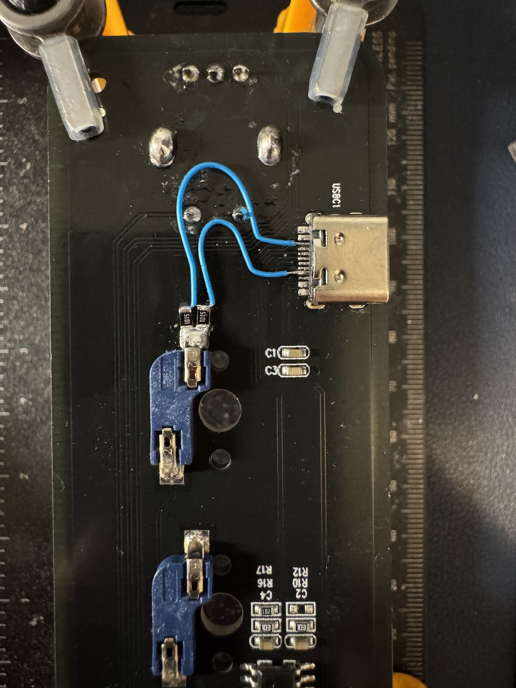
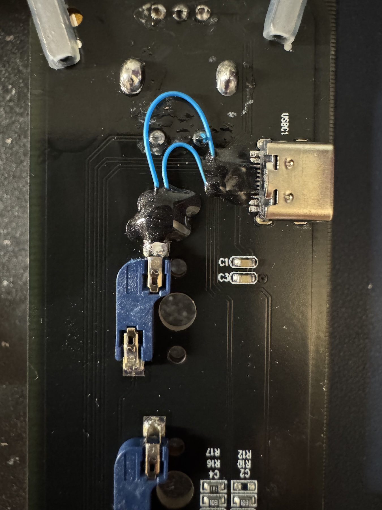

## Enabling USB-C Cable Support

Unlike USB-A ports, which output 5V by default, USB-C is more complex. In order to enable the 5V output, devices need to include a pair of 5.1kΩ pull-down resistors on the two Configuration Channel (CC) lines. Like many cheap USB-C devices, these macropads omit those resistors. Because of this, the device remains completely unpowered when using a standard USB-C to USB-C cable, forcing you to use an older USB-A to USB-C cable, a dongle, or [an adapter that specifically adds the resistors back](https://hagibis.com/products/hagibis-usb-c-51k-pull-down-resistor-adapter).

To fix this and achieve full support from any USB-C cable (as long as it supports both power and data), you will need to add the two 5.1kΩ resistors directly to the CC pins on the USB-C port. Frustratingly, the CC pins have no traces or test points connected to them, so this is a relatively advanced mod that requires precision soldering skill.

### The USB-C Socket Pinout
The board uses a single-row 12-pin hybrid SMT USB-C port. Looking down at the top of the PCB with the USB port opening facing away from you and the solder pads facing toward you, the physical pin layout from left to right is:

| Pin # | Label | Function / Destination |
| :--- | :--- | :--- |
| **1** | **GND** | Ground (Double-wide pad) |
| **2** | **VBUS** | +5V (Double-wide pad) |
| **3** | **CC1** | Solder first 5.1kΩ resistor between this pin and GND |
| **4** | **SBU2** | Unused / Floating |
| **5** | **D-** | USB Data Negative (Side B) |
| **6** | **D+** | USB Data Positive (Side A) |
| **7** | **D-** | USB Data Negative (Side A) |
| **8** | **D+** | USB Data Positive (Side B) |
| **9** | **SBU1** | Unused / Floating |
| **10** | **CC2** | Solder second 5.1kΩ resistor between this pin and GND |
| **11** | **VBUS** | +5V (Double-wide pad) |
| **12** | **GND** | Ground (Double-wide pad) |

### Modification Steps
1. Prepare the Resistors
    - Through-hole resistor legs are too thick and will bridge the tight 0.5mm pitch USB-C pins. 0805 resistors offer a good balance of ease of soldering while still remaining plenty small for this mod
2. Anchor to Ground
    - Use the ground pad (closer to the encoder wheel) of one of the Cherry key sockets as your anchoring spot. Solder one side of both 0805 resistors directly to this ground pad, but make sure the other sides of the resistors are not touching each other
3. Route the CC Lines:
    - Use thin enamel magnet wire or hookup wire (32 AWG - 36 AWG) to bridge the remaining open side of each resistor to the USB-C pins. Burn the enamel coating off the tips with a pre-tinned iron before attaching them to Pin 3 and Pin 10 of the USB port 
4. Test the Resistance:
    - Use a multimeter to measure the resistance from Pin 3 to GND, and Pin 10 to GND. Each must read 5.1kΩ (give or take about 10%). Ensure there is no continuity between Pin 3 and Pin 10, as a short here will trigger a safety shut-off in the charger

### Adding Strain-Relief
USB-C cables can exert mechanical tension on the socket's pins when plugged and unplugged, which can lead to micro-fractures in the solder joints. To prevent this, apply a small dab of UV-cure solder mask, or lacking that, non-gel nail polish, directly over the enamel wires and the 0805 resistors to hold them firmly in place. If you don't have either, hot glue would probably work too, just be sure you blobs are too tall to prevent the bottom shell from going back on.

> [!CAUTION] 
> Do not let the solder mask or nail polish get inside the metal casing of the USB socket, or it will prevent your cable from fitting and/or making proper contact

Use a UV flashlight to cure the solder mask for 1-2 minutes or allow the nail-polish plenty of time to air-dry completely (mine took nearly an hour, since it was so thick).

